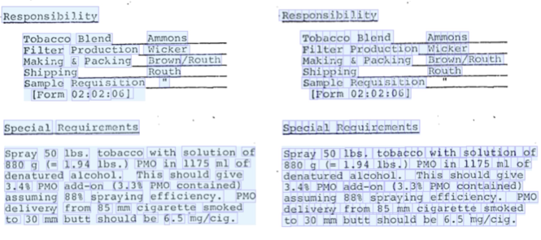
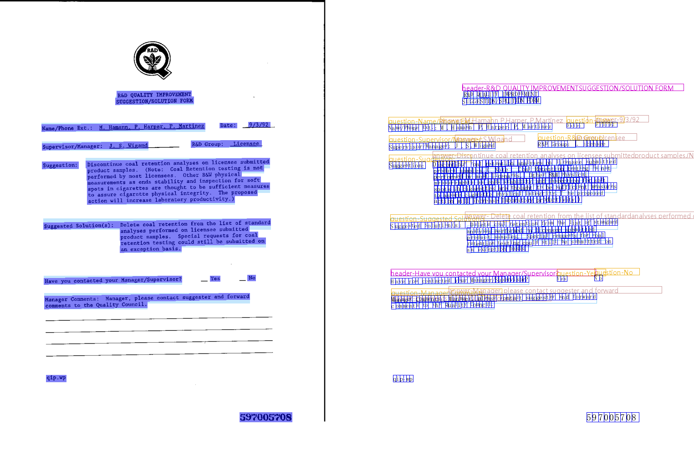
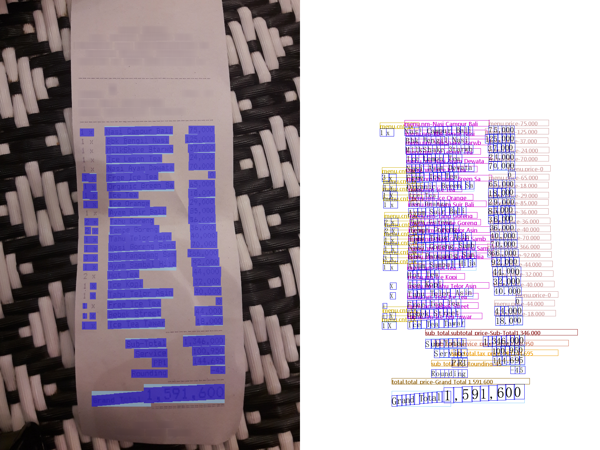

# Reading Order Matters: Information Extraction from Visually-rich Documents by Token Path Prediction

This is the official repository of the revised datasets FUNSD-r and CORD-r, introduced in EMNLP 2023 paper `Reading Order Matters: Information Extraction from Visually-rich Documents by Token Path Prediction`. 



## Datasets

The structure of the released datasets is listed below, taking `FUNSD-r` as an example, in which:
* `labels_bio.txt` and `labels.txt` denote the entity types of the task. These files are used in sequence-labeling methods and TPP methods, respectively. 
* `data.*.txt` denotes the train/val/test split of the dataset. The format of each row is `images/0000971160.png jsons/0000971160.json` to specify a document sample. 
* `images` and `jsons` contain the document images and layout+NER annotations of the samples. 
  * The image files of CORD are too large and thus not provided. Please run `CORD-r/main.py` to download from huggingface. 

```
FUNSD-r
├── images
│   ├── 0000971160.png
│   ├── 0000989556.png
│   ├── ...
│   └── 93455715.png
├── jsons
│   ├── 0000971160.json
│   ├── 0000989556.json
│   ├── ...
│   └── 93455715.json
├── data.train.txt
├── data.val.txt
├── data.test.txt
├── labels_bio.txt
└── labels.txt
```

One sample layout+NER annotation is displayed below, in which:
* `"uid"` identifies the data sample. 
* `"img"` refers to the corresponding document image.
* `"document"` refers to the corresponding layout annotations. Each element refers to one segment.
  * `"id"` identifies the segment. `"box"` and `"bndbox"` refers to the position box of the segment. `"text"` refers to the text the segment contains.
  * `"words"` refers to the characters within the segment, where
    * `"id"` identifies the character, globally within the sample, and is used in `"label_entities"`. `"box"` and `"bndbox"` refers to the position box of the character. `"text"` refers to the value of the character.
* `"label_entities"` refers to the corresponding NER annotations. Each element refers to one entity.
  * `"entity_id"` identifies the entity. `label` refers to the entity type.
  * `"word_idx"` refers to the character sequence that composes the entity, denoted by a list of character indexes.

```json
{
    "img": {
        "height": 1296,
        "width": 864,
        "image_path": "train_0001.png"
    },
    "document": [
        {
            "id": 0,
            "box": [123, 481, 452, 509],
            "bndbox": [
                [123, 481],
                [452, 481],
                [452, 509],
                [123, 509]
            ],
            "text": "SPGTHY BOLDGNASE",
            "words": [
                {
                    "id": 0,
                    "box": [123, 481, 144, 509],
                    "bndbox": [
                        [123, 481],
                        [144, 481],
                        [144, 509],
                        [123, 509]
                    ],
                    "text": "S"
                },
                ...
            ]
        },
        ...
    ],
    "uid": "train_0001",
    "label_entities": [
        {
            "entity_id": 0,
            "label": "menu.cnt",
            "word_idx": [16]
        },
        {
            "entity_id": 1,
            "label": "menu.nm",
            "word_idx": [0, 1, 2, 3, 4, 5, 6, 7, 8, 9, 10, 11, 12, 13, 14, 15]
        },
        ...
    ]
}
```

The benchmarks are available at Paperwithcode. [[FUNSD-r]](https://paperswithcode.com/dataset/funsd-r) [[CORD-r]](https://paperswithcode.com/dataset/cord-r)

## Examples





## Citation

If you found this repository useful, please cite our paper:

```
@article{zhang2023reading,
  title={Reading Order Matters: Information Extraction from Visually-rich Documents by Token Path Prediction},
  author={Zhang, Chong and Guo, Ya and Tu, Yi and Chen, Huan and Tang, Jinyang and Zhu, Huijia and Zhang, Qi and Gui, Tao},
  journal={arXiv preprint arXiv:2310.11016},
  year={2023}
}
```


## License

All datasets in this repository are released under the CC BY 4.0 International license, which can be found here: https://creativecommons.org/licenses/by/4.0/legalcode. 
FUNSD-r and CORD-r utilize the [FUNSD](https://guillaumejaume.github.io/FUNSD/work/) and [CORD](https://huggingface.co/datasets/naver-clova-ix/cord-v2) datasets, along with their respective licensing agreements. 
